Pursing updates I am making to my personal infrastructure, I wanted to deploy a
Kubernetes cluster. This was supposed to be the new way I would deploy services
to my infrastructure, and as such resources would be transfered to this cluster
as I was moving services to it. Unfortunately, as I started moving a couple
services to it, it exploded in my hands because the disks were not following
with the etcd instances, ending up with the etcd leader giving up and the
cluster not being able to elect a new leader as all of the members were lagging
behind.

Of course there was no other way this could have turned out, as my server has
two hard drives, each with over 50000 of power-on hours and some reallocated
sectors here and there. Both are 7200 rpm and in a RAID 1, but of course that
didn't help.

And so I decided to get myself a brand new server, with new disks and some SSD
to act as caching devices. I now have two disks with the following specs:

* HGST HUH721008ALE600
* 8TB capacity
* 7200 rpm
* SATA 3.2, 6.0 Gb/s

I also have two NVMe drives, with the following specs:

* SAMSUNG MZVLB512HBJQ-00000
* 512GB capacity

As for all the personal installations I do, I decided to go with ZFS as the
base filesystem for this server. The hard drives were going to be encrypted and
end up in a mirror, whereas I didn't know what I would do with the SSD. Should
I set them up as two cache devices, two log devices, one each, should I encrypt
them? And so I decided to run some benchmarking to be sure I would get the best
setup I could, while knowing that adding/removing cache and log devices in ZFS
is easy and fast and I could do it at any moment should I need to.

## What I would bench

As I didn't exactly know what I was looking for, I decided to do some reading
and find out what I should bench. I stumbled upon [this very helpful
article](https://support.binarylane.com.au/support/solutions/articles/1000055889-how-to-benchmark-disk-i-o)
describing what options I could use with `fio` to benchmark the different
aspects of disk performance. As I still didn't know which knobs to turn to
imitate etcd disk usage, I went and tested them all. As such, I would test all
those `fio` modes: `read randread readwrite randrw write randwrite` with those
block sizes: `512 4k 8k 16k 64k 1m`, in `sync` and `async` mode. That, with
nine different disk setup, would amount to 648 different benchmarks. At that
point, I had to script stuff.

## Setup

The drives are described above, as for the software used, here it is:

```bash
$ dd --version
dd (coreutils) 8.31
$ fio --version
fio-3.22
$ zfs --version
zfs-0.8.4-1
zfs-kmod-0.8.4-1
$ cryptsetup --version
cryptsetup 2.3.3
$ mke2fs -V
mke2fs 1.45.5 (07-Jan-2020)
        Using EXT2FS Library version 1.45.5
$ nixos-version
20.09.20201010.51aaa3f (Nightingale)
```

Here is the configuration of the pool I ran the benchmarks on. I didn't turn
any particular knobs, except `ashift=12`.

```
NAME   PROPERTY                       VALUE                          SOURCE
rpool  size                           7.20T                          -
rpool  capacity                       5%                             -
rpool  altroot                        -                              default
rpool  health                         ONLINE                         -
rpool  guid                           6988174159253467568            -
rpool  version                        -                              default
rpool  bootfs                         -                              default
rpool  delegation                     on                             default
rpool  autoreplace                    off                            default
rpool  cachefile                      -                              default
rpool  failmode                       wait                           default
rpool  listsnapshots                  off                            default
rpool  autoexpand                     off                            default
rpool  dedupditto                     0                              default
rpool  dedupratio                     1.00x                          -
rpool  free                           6.78T                          -
rpool  allocated                      436G                           -
rpool  readonly                       off                            -
rpool  ashift                         12                             local
rpool  comment                        -                              default
rpool  expandsize                     -                              -
rpool  freeing                        0                              -
rpool  fragmentation                  21%                            -
rpool  leaked                         0                              -
rpool  multihost                      off                            default
rpool  checkpoint                     -                              -
rpool  load_guid                      4725347622303544489            -
rpool  autotrim                       off                            default
rpool  feature@async_destroy          enabled                        local
rpool  feature@empty_bpobj            active                         local
rpool  feature@lz4_compress           active                         local
rpool  feature@multi_vdev_crash_dump  enabled                        local
rpool  feature@spacemap_histogram     active                         local
rpool  feature@enabled_txg            active                         local
rpool  feature@hole_birth             active                         local
rpool  feature@extensible_dataset     active                         local
rpool  feature@embedded_data          active                         local
rpool  feature@bookmarks              enabled                        local
rpool  feature@filesystem_limits      enabled                        local
rpool  feature@large_blocks           enabled                        local
rpool  feature@large_dnode            active                         local
rpool  feature@sha512                 enabled                        local
rpool  feature@skein                  enabled                        local
rpool  feature@edonr                  enabled                        local
rpool  feature@userobj_accounting     active                         local
rpool  feature@encryption             enabled                        local
rpool  feature@project_quota          active                         local
rpool  feature@device_removal         enabled                        local
rpool  feature@obsolete_counts        enabled                        local
rpool  feature@zpool_checkpoint       enabled                        local
rpool  feature@spacemap_v2            active                         local
rpool  feature@allocation_classes     enabled                        local
rpool  feature@resilver_defer         enabled                        local
rpool  feature@bookmark_v2            enabled                        local
```

As for my testing script, you can find it [here](./bench.sh) and the data file
from which it pulls some of its configuration is [here](./data.sh). There are a
bunch of `echo`s and `date`s commands stuffed in there so I could organically
monitor the progress of a benchmark. I didn't want to automate changing the
disk configuration so I just changed the `benchName` variable every time I
benched another configuration, but it could probably be fully automated.

For the tests, I created a new zvol, as my etcd cluster runs on VMs backed by
zvols `zfs create -V 1t rpool/bench` and formatted it in ext4, which, again, is
what the VMs will be using `mkfs.ext4 /dev/zvol/rpool/bench`. The `bench.sh`
script had to be called inside the directory where this zvol would be mounted,
and if you look closely, you'll see that the `--name=bench` option passed to
`fio` is never changed. That way, `fio` can reuse whatever file is leftover
from the previous test and doesn't have to reallocate it before being able to
actually perform the test. Note that per `fio`'s own documentation, this does
not affect the result of the tests.

Also, when changing disk configuration, cache and log devices were always
removed from the pool before being added again, so ZFS wouldn't reuse data that
was left on them from previous tests.

As I haven't mentioned it previously, here are the different combination of
cache and log devices I would be benchmarking:

* the mirrored drives alone;
* one cache device;
* one log device;
* two cache devices;
* two log devices;
* one cache, one log;
* one encrypted cache device;
* one encrypted log device;
* one encrypted cache, one encrypted log.

Encryption was done with this command:

```bash
cryptsetup -v --type luks2 --cipher aes-xts-plain64 --hash sha512 --iter-time 5000 --key-size 512 --use-random --verify-passphrase luksFormat $device
```

## Collecting and processing data

`fio` will output the results of the test in two formats: terse and json.
Again, as I didn't know exactly how I would process my files, I decided to
output in both formats and decide later what I would use. I decided to go with
json, and as such, I had to split the output files to only get the json output.
That's done in [`split_files.sh`](./split_files.sh), which, as the other
processing scripts, has to be run inside the folder where all the `.out` files
are. An example of a `.json` is this. Information has been truncated to avoid
too much noise here.

```json
{
  "fio version" : "fio-3.22",
  "timestamp" : 1604522762,
  "timestamp_ms" : 1604522762960,
  "time" : "Wed Nov  4 21:46:02 2020",
  "jobs" : [
    {
      "jobname" : "test",
      "elapsed" : 181,
      "job options" : {
        "name" : "test",
        "direct" : "1",
        "ioengine" : "libaio",
        "size" : "100G",
        "runtime" : "180",
        "iodepth" : "64",
        "numjobs" : "8",
        "bs" : "16k",
        "rw" : "randread"
      },
      "read" : {
        "io_bytes" : 2236039168,
        "bw_bytes" : 12371168,
        "iops" : 755.076184,
        "runtime" : 180746,
        "total_ios" : 136477,
        "bw_min" : 6272,
        "bw_max" : 25184,
        "bw_agg" : 100.000000,
        "bw_mean" : 12086.488889,
        "bw_dev" : 315.776481,
        "bw_samples" : 2880,
        "iops_min" : 392,
        "iops_max" : 1574,
        "iops_mean" : 755.405556,
        "iops_stddev" : 19.736030,
        "iops_samples" : 2880
      }
    }
  ]
}
```

Let's extract data from those new `.json` files and structure it. That is done
by [`aggregate_data.sh`](./aggregate_data.sh) which extracts the read and write
IOPS and bandwidth from the tests and stores them by readwrite mode (`read
randread readwrite randrw write randwrite`) and sync mode (`sync async`) in
`.dat` files that will then be processed by the next script, and look like
this. Again, information has been truncated.

```tsv
# config	bs	read-iops	write-iops	read-bw_MB	write_bw_MB

mirror	16k	483.65977	0	7.557183265686035	0
mirror-cache	16k	446.477802	0	6.976215362548828	0
mirror-log	16k	727.970618	0	11.374540328979492	0
mirror-cache-cache	16k	755.076184	0	11.798065185546875	0
mirror-log-log	16k	699.743181	0	10.933486938476562	0
mirror-cache-log	16k	820.998345	0	12.82809829711914	0
mirror-cryptcache	16k	814.000409	0	12.718755722045898	0
mirror-cryptlog	16k	578.483986	0	9.038811683654785	0
mirror-cryptcache-cryptlog	16k	828.471354	0	12.944864273071289	0
```

Time for some graphs! Finally we will get to see some actual results that are
nice to look at. I am using `gnuplot` to create the graphs. As such, we need to
create files that it can read. This is done in [`plot.sh`](./plot.sh) and will
create files like this:

```gnuplot
set terminal pngcairo
set title "read sync iops read"
plot \
    "<(sed -n '/^mirror\t/p' read-sync.dat)" using 3:xticlabels(2) with linespoints title 'mirror', \
    "<(sed -n '/^mirror-cache\t/p' read-sync.dat)" using 3:xticlabels(2) with linespoints title 'mirror-cache', \
    "<(sed -n '/^mirror-log\t/p' read-sync.dat)" using 3:xticlabels(2) with linespoints title 'mirror-log', \
    "<(sed -n '/^mirror-cache-cache\t/p' read-sync.dat)" using 3:xticlabels(2) with linespoints title 'mirror-cache-cache', \
    "<(sed -n '/^mirror-log-log\t/p' read-sync.dat)" using 3:xticlabels(2) with linespoints title 'mirror-log-log', \
    "<(sed -n '/^mirror-cache-log\t/p' read-sync.dat)" using 3:xticlabels(2) with linespoints title 'mirror-cache-log', \
    "<(sed -n '/^mirror-cryptcache\t/p' read-sync.dat)" using 3:xticlabels(2) with linespoints title 'mirror-cryptcache', \
    "<(sed -n '/^mirror-cryptlog\t/p' read-sync.dat)" using 3:xticlabels(2) with linespoints title 'mirror-cryptlog', \
    "<(sed -n '/^mirror-cryptcache-cryptlog\t/p' read-sync.dat)" using 3:xticlabels(2) with linespoints title 'mirror-cryptcache-cryptlog', \
;
```

What it does is that it selects a data column (`read-iops`, `write-iops`,
`read-bw_MB` or `write-bw_MB`) and plots it against the block size, and that
for each disk configuration. Let's have a look at what it outputs!

There is also a [`sort_pngs.sh`](./sort_pngs.sh) script that sorts the output
files in subfolders.

## Results

### Sync

As I will have several virtual machines each doing their read and writes,
`sync` aren't really relevant for me, and as such I won't go over them, but
here they are:

|       |       |
| :---- | ----: |
| 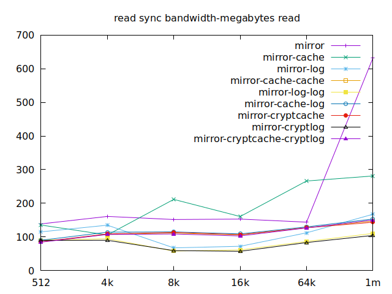 | 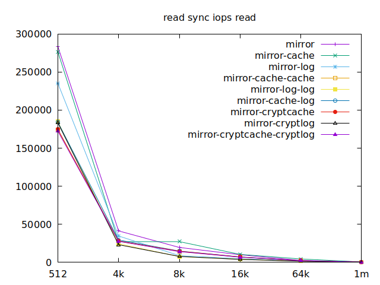 |
| 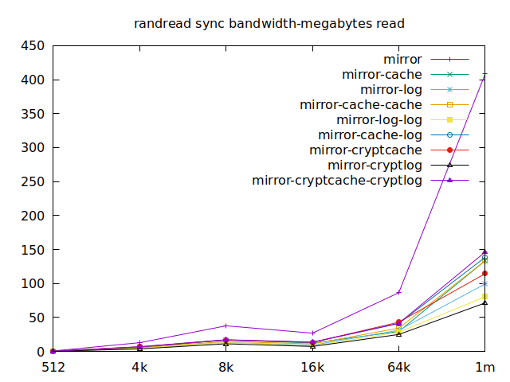 | 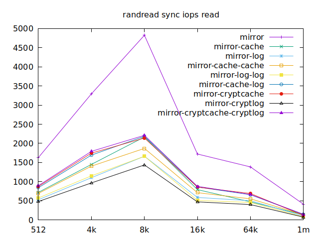 |
|  | 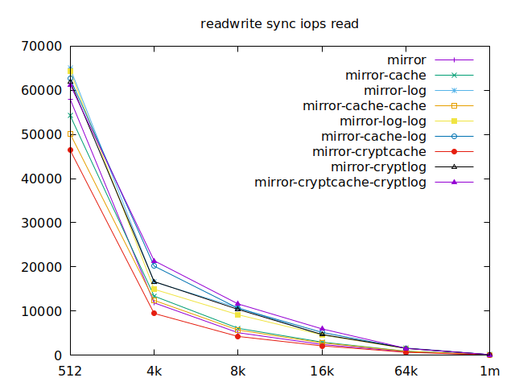 |
| 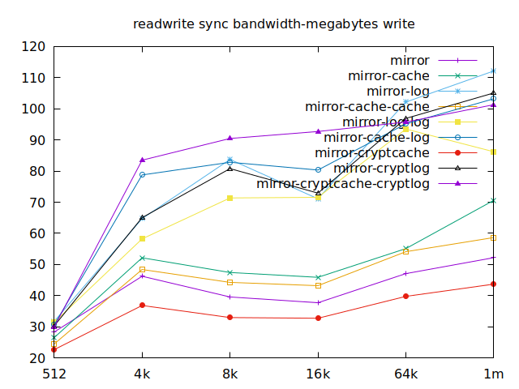 | 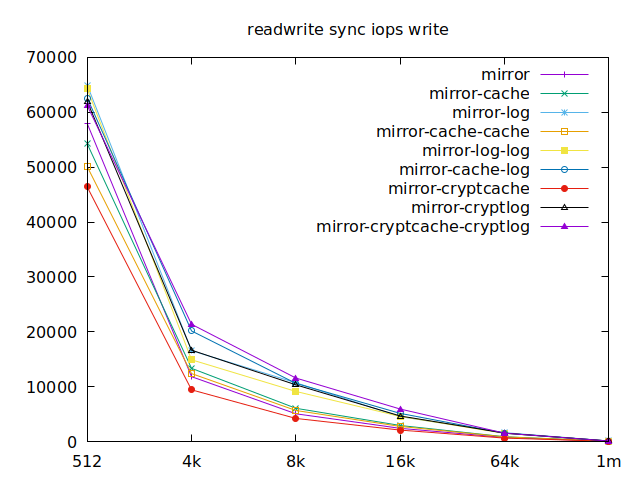 |
|  | 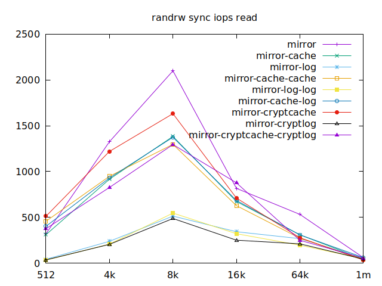 |
| 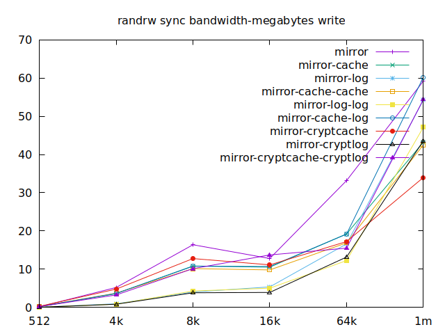 |  |
| 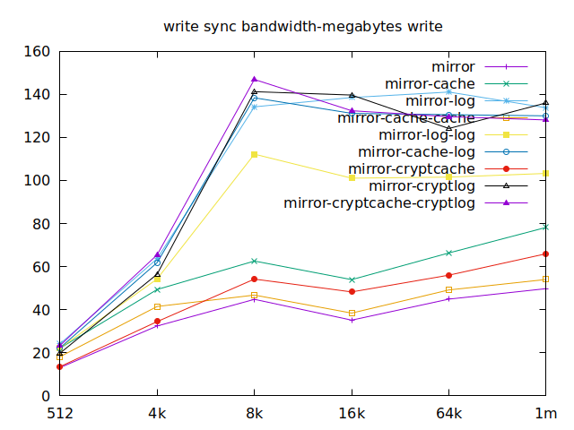 | 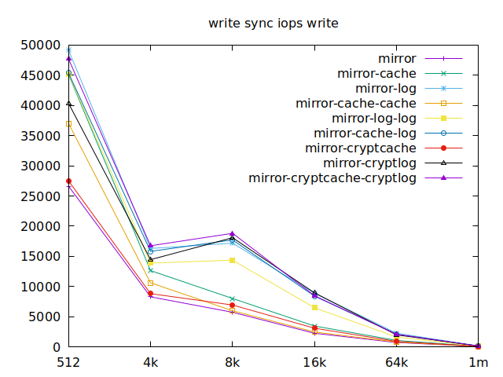 |
| 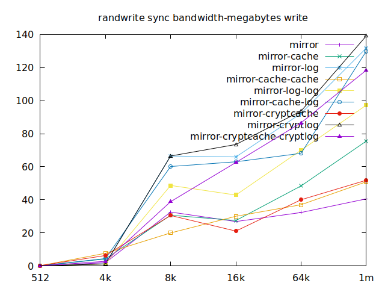 | 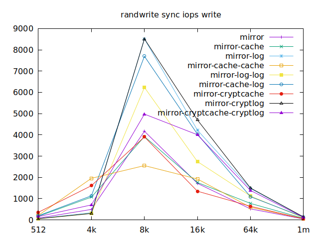 |

### Async

|       |       |
| :---- | ----: |
| 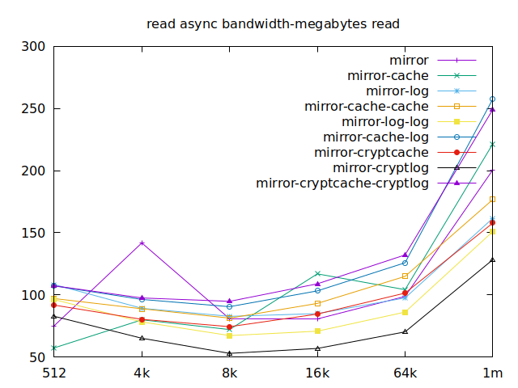 | 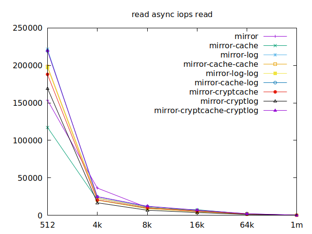 |
| 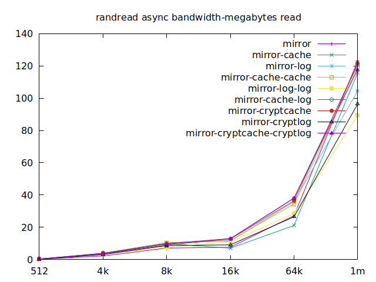 | 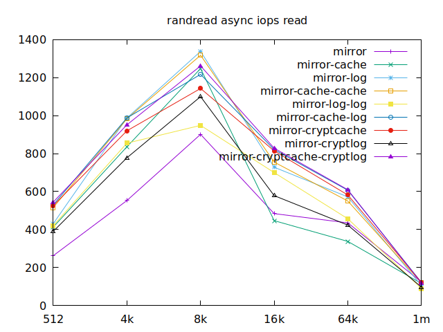 |
| 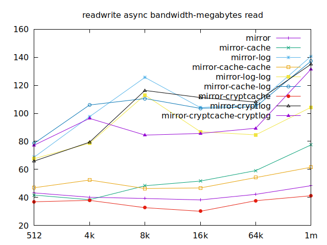 | 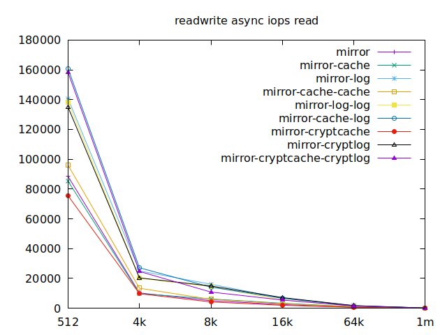 |
|  |  |
| 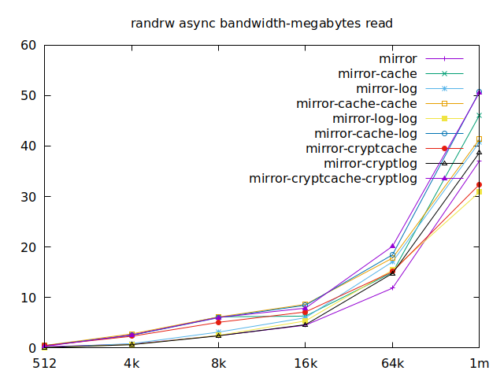 |  |
| 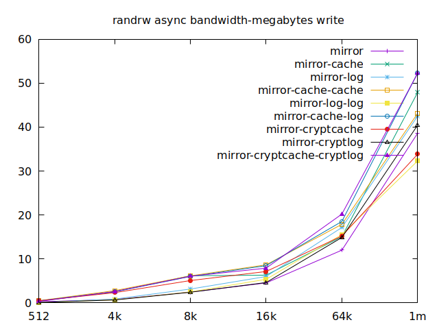 | 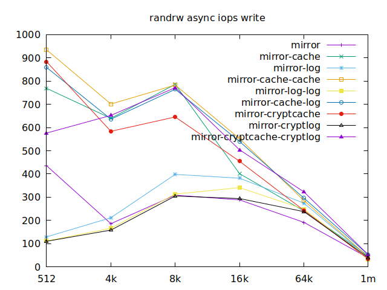 |
| 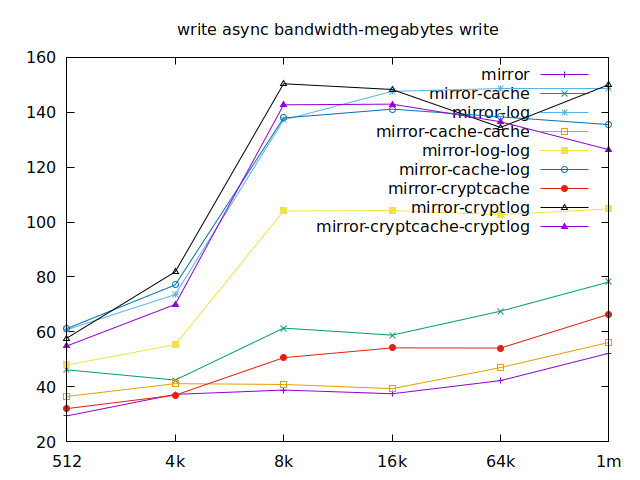 | 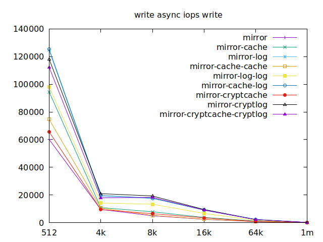 |
| 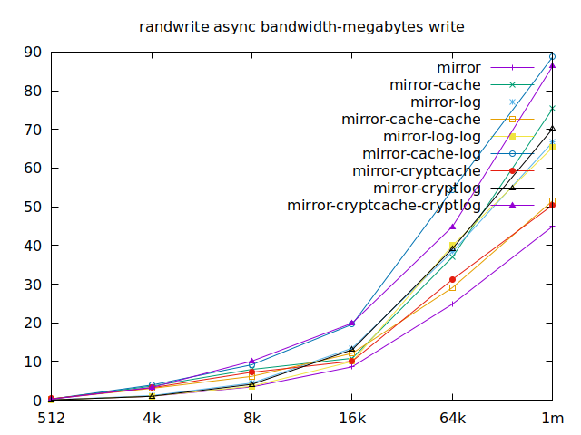 | 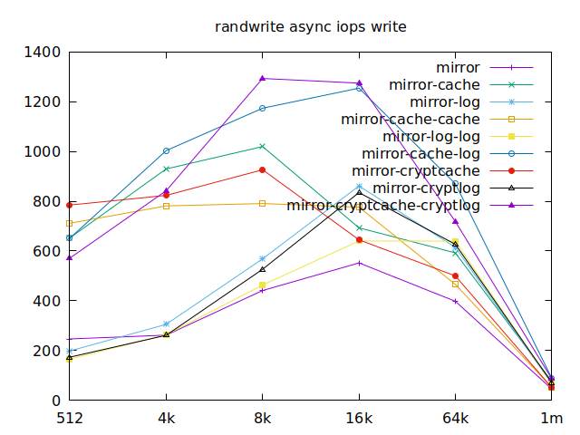 |

Now is the time to find out which of these tests actually comes closer to what
etcd would do with the disk. The etcd
[docs](https://etcd.io/docs/v3.4.0/op-guide/hardware/#disks) tell us that we
should use `fio` or `diskbench` to try out our disks which we did. Fortunately,
they link us to an article from IBM for an example, maybe it has information
about what we should have tested in the first place. Unfortunately, the link is
broken, but I [tracked it down](https://github.com/etcd-io/website/pull/79) and
it now is
[here](https://www.ibm.com/cloud/blog/using-fio-to-tell-whether-your-storage-is-fast-enough-for-etcd).
Apparently, we should look at `write` results, with a block size of about
`2300`, at least in their setup. So we'll look for `4k` in our benchmarks.
We'll also look at `randwrite`, as we have several etcd writing to the same
disk. It appears that a single log device comes on top, which makes sense, and
then a single cache device, and in third place the duo of encrypted cache and
log devices. As etcd isn't the only thing that's going to use those disks,
let's take a quick look at the other results, and yes, it seems that the duo of
encrypted cache and log devices always comes in second of third place.

This is the setup I ended up choosing as it was the most versatile one and it
is encrypted.

All the files for this are available
[here](https://gitlab.com/risson/risson.space/-/tree/master/content/posts/2020-12-07-benchmarking-zfs-cache-log).

If you want to discuss this any more, don't hesitate to reach out!
