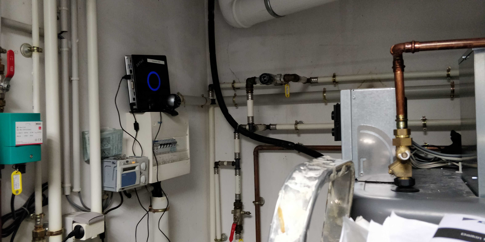
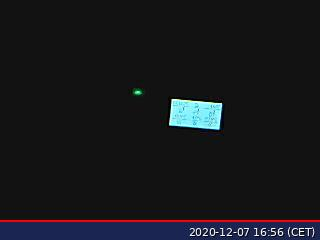
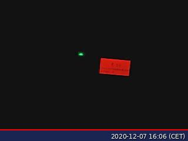
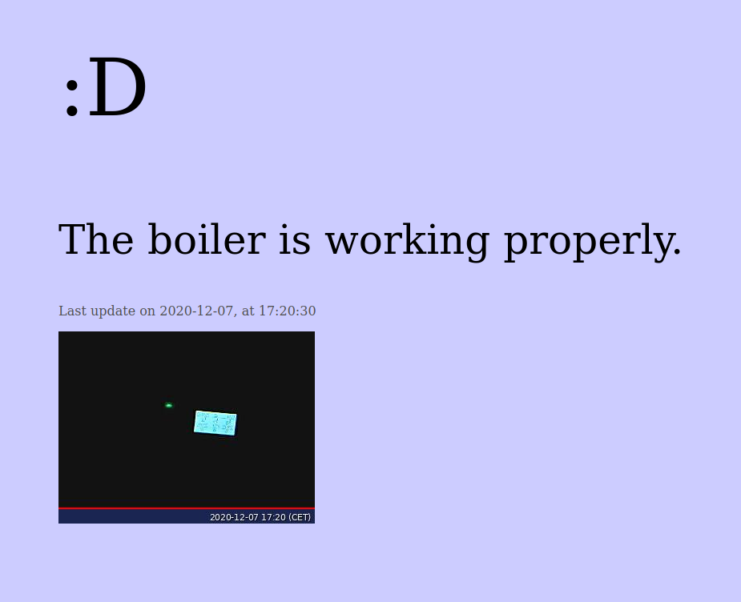
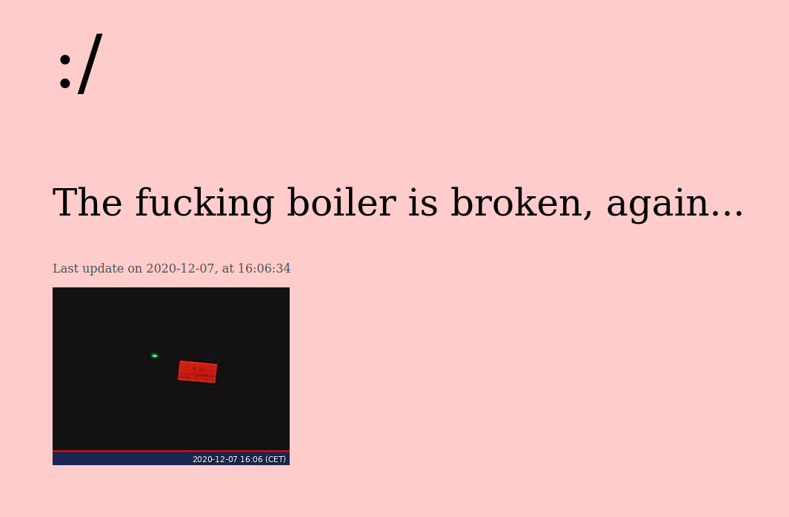
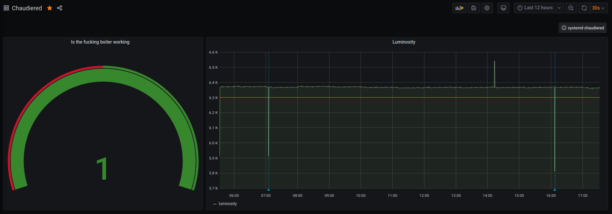

A few weeks ago, my house's boiler started breaking down. I won't go in any
technical details (because I don't know them myself), but basically it goes
into "security" mode, and you have to clear the error manually. As it is winter
in this part of the world, it was a bit annoying, but it was happening only
once or twice a week, so we just checked in the morning and in the evening and
reset it if necessary.

However, last week it started to happen more and more frequently, so I got fed
up and decided to do something about it. And by that, I don't mean fix it, I
don't have the knowledge to do anything about it, nor does the technician who
is supposed to have fixed it last Friday apparently. The only thing I wanted is
to get some kind of notification when it breaks down, so I don't have to check
on it every hour or so.

And so I needed to detect when it goes down. Unfortunately, those things don't
have an ethernet port nor an API you can just query to detect if anything goes
wrong. Here's an idea to you boiler manufacturers, just add SNMP, it's not that
hard. When the boiler goes down, its screen turns red, now that's something I
can work with.

At [Prologin](https://prologin.org), an association which I'm a member of, we
have a webcam monitoring the luminosity in our offices, so anyone in the
association can know when people are there and can just come and give a hand,
or chat or whatever it is people do. So I stole the idea and adapted it to my
situation.

I set up a small computer and a webcam facing the boiler's screen, and a
systemd service that executes a script and updates a web page according to what
it sees. Here's what it looks like:



```bash
now="$(date --iso=seconds)"
htmlDir="/var/www/html/"
imageFilename="chaudiered-${now}.jpg"
imageFile="${htmlDir}/${imageFilename}"

fswebcam -d /dev/video0 --save "${imageFile}"

luminosity="$(identify -format %[mean] "${imageFile}" | cut -d'.' -f1)"

if [[ "${luminosity}" > 6300 ]]; then
  isWorking=1
else
  isWorking=0
fi

# You can see where this is going, can't you
cat > "${htmlDir}/metrics" <<EOF
chaudiered_status ${isWorking}
chaudiered_luminosity ${luminosity}
EOF
```

I didn't include the actual web page update to keep it small, but you can find
the whole script
[here](https://gitlab.com/lama-corp/infra/dotshabka/-/blob/5141fa89874b53d8863ac6efdfbcdf318c2b5e3f/hosts/cuckoo/chaudiered.sh).

What it does, is it takes a pictures from the webcam using `fswebcam`, and then
gets its `mean` value with imagemagick's `identify` tool. According to their
documentation, `mean` means the "average value statistic of image". Those
statistics include "the channel depth, its minima, maxima, mean, standard
deviation, kurtosis and skewness", and that for all channels in the image.
Fortunately, when the screen turns red, this `mean` value goes down, so I can
detect that! Here's an image of the boiler when it is working, and one when it
broke down:

| | |
| :- | -: |
|  |  |

When it is working, the `mean` value is about 6375, and when it's not, it drops
to about 5515. I am now able to detect when it breaks down and correctly update
the web page, which might still be available
[here](https://chaudiered.risson.space):

| | |
| :- | -: |
|  |  |

But I wasn't going to stop here. Remember the `metrics` file the script writes
to? That's right, I setup a [Prometheus](https://prometheus.lama-corp.space)
and a [Grafana
dashboard](https://grafana.lama-corp.space/d/-YNJB90Mk/chaudiered) so I can see
when it broke down and report that to whoever is going to fix, or at least try
to fix, the boiler.



One last thing I needed was to get notified when the boiler broke down. I did
that with a simple incoming webhook into my Mattermost instance, nothing fancy
here.

Going further? It would be great to have a better webcam to actually see what's
written on the screen, and thus get the error code it reports when it breaks
down, but also get temperature metrics when it works properly. Also, with some
time and an arduino board I could probably build an automated arm that does the
reseting manually, but this is not supposed to happen and shouldn't be fixed
that way.

If you want to discuss this any more, don't hesitate to reach out!
